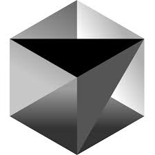
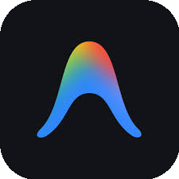
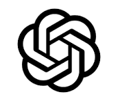
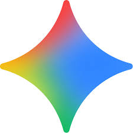

# 💫 About Me:
⚒️ Hello Work!
⚡ Full Stack Website!

## 🌐 Socials:
    

# 💻 Tech Stack:
#### 🔤 Languages
      
#### 📚 Frameworks & Libraries
      
#### 🗄️ Databases
 
#### 🛠️ DevOps & Tools
  
#### 🧠 AI Stack
    

# 📊 GitHub Stats:
 
 

---

## 💰 You can help me by Donating
| | Bank | Account Number | Account Name |
|---|------|---------------|--------------|
|  | **Vietcombank** | `1049850384` | **NGUYEN DUY KHANH** |
|  | **MBBank** | `139365` | **NGUYEN DUY KHANH** |
